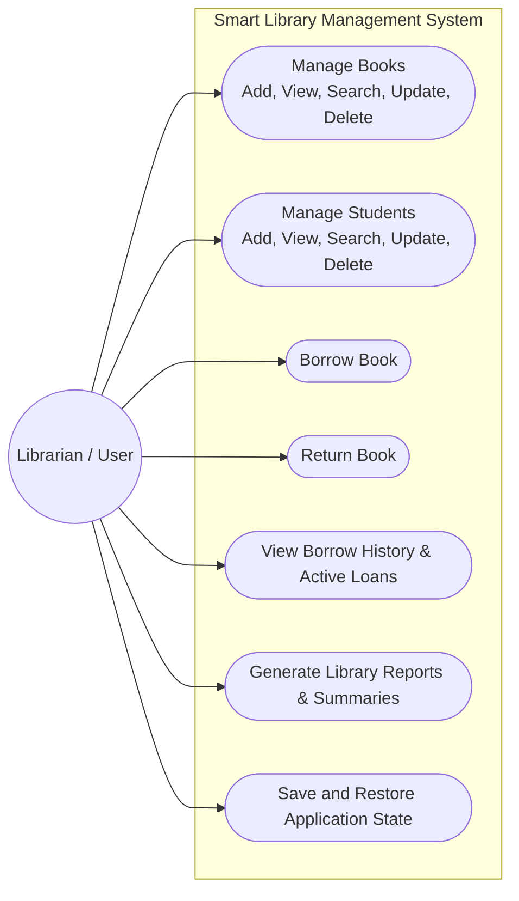
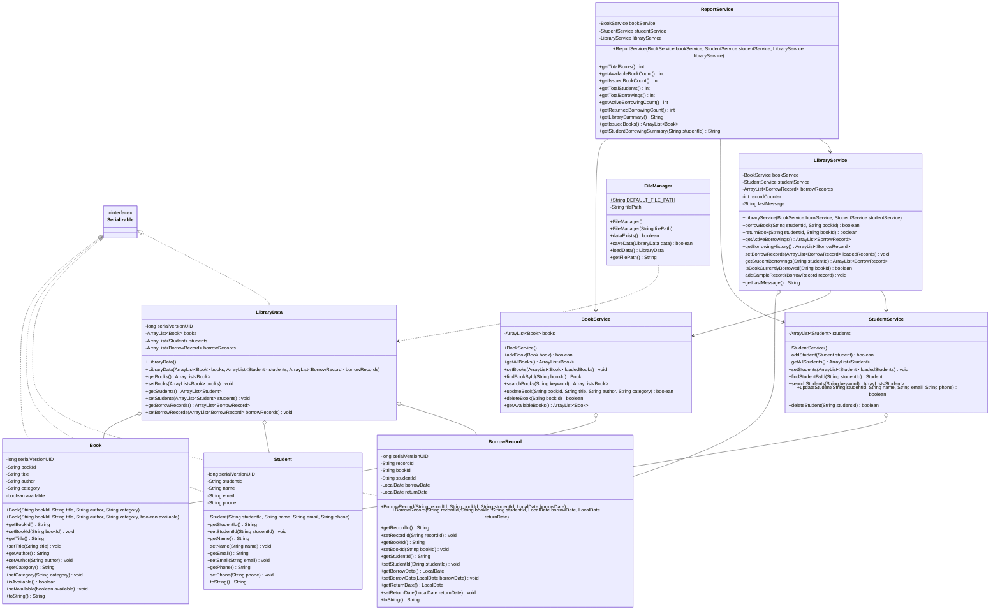
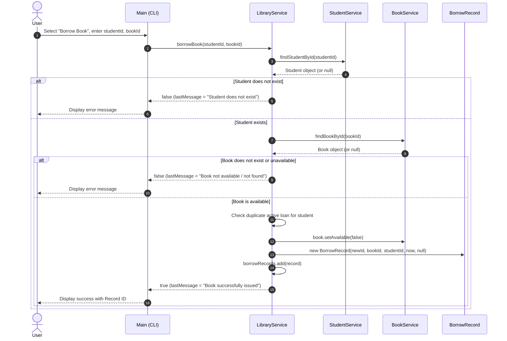
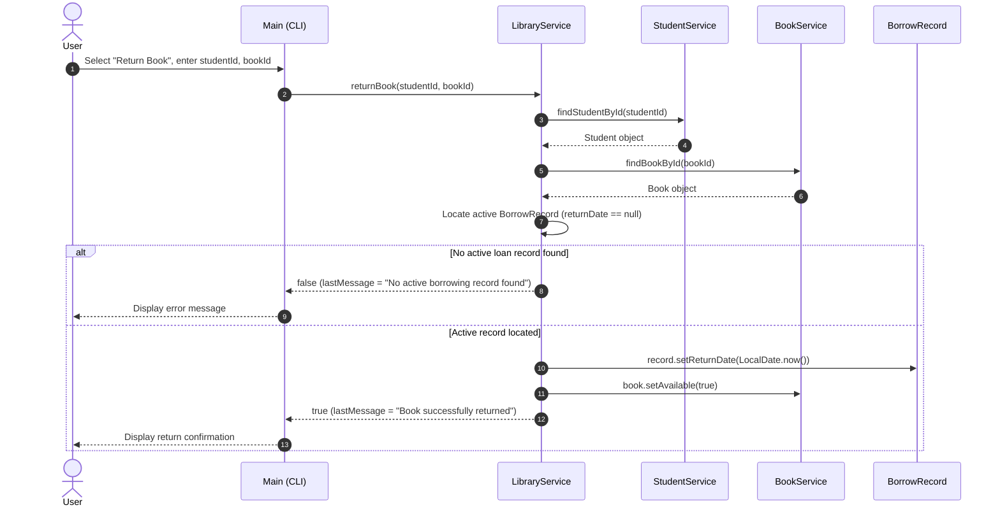

# UML Diagrams: Smart Library Management System

This document provides visual models of the system using standard **Mermaid** notation, accurately reflecting the implemented classes, methods, and execution workflows.

---

## 1. Use Case Diagram

---

## 2. Class Diagram

---

## 3. Sequence Diagram: Borrow Book

---

## 4. Sequence Diagram: Return Book

